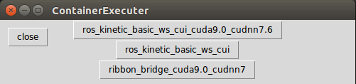

# docker_ws

Docker環境セットアップの方法とDockerfileをまとめたリポジトリ

## Install Docker
```
cd ~/

git clone https://gitlab.com/TeamSOBITS/docker_ws.git

bash install_docker.sh

#Dockerコンテナ内でGPUを使う人は以下のコマンドも実行してください。
bash install_nvidia_docker.sh

#container_executer.pyを使う人は以下のコマンドも実行してください。
sudo apt-get install tk-dev
python -m Tkinter #GUIが表示されればインストール完了
```

## How to use
containerディレクトリ内に様々な環境のDockerfileを用意しています。
コンテナの環境情報や起動方法等は、各ディレクトリの中にあるREADMEを参照してください。
ホストPCがUbuntu16の場合、DNSサーバの設定をする必要があるので、[DNS server setting](#dns-server-setting)を参照してください。

## Container Executer


起動中のコンテナの一覧を表示し、入りたいコンテナをクリックすることで中に入ることができます。
```
#実行方法
python ~/docker_ws/container_executer.py
```

aliasで設定しておくと便利だと思います。  
```
#.bashrcに以下を追記
alias ce="python ~/docker_ws/container_executer.py"
```


## DNS server setting
Ubuntu16上でDockerコンテナを起動する際、コンテナ内でネットワークに繋がらない場合は、以下の設定をしてください。


- ### ホストPC上で打ち込むコマンド
  ```bash
  # daemon.jsonの確認
  cat /etc/docker/daemon.json

  #何も表示されない場合は、新しく作成
  sudo touch /etc/docker/daemon.json

  #daemon.jsonをエディタで開く
  sudo gedit /etc/docker/daemon.json
  ```


  以下の項目を記入（x.x.x.xにはホストPCが繋がっているネットワークのDNSサーバのIP or デフォルトゲートウェイを記入する）
  ``` json daemon.json
  {
    "dns":["x.x.x.x","x.x.x.y"]
  }
  ```

  nvidia-dockerをインストールしている場合は既に、daemon.jsonに"runtime"の設定が記述されているので、
  ```json daemon.json
  {
    "runtimes": {
        "nvidia": {
          "path": "/usr/bin/nvidia-container-runtime",
          "runtimeArgs": []
      }
    }
  }
  ```

  こんな感じで、dnsの設定を追記する
  ```json daemon.json
  {
    "dns":["x.x.x.x","x.x.x.y"],
    "runtimes": {
        "nvidia": {
          "path": "/usr/bin/nvidia-container-runtime",
          "runtimeArgs": []
      }
    }
  }
  ```

  Dockerを再起動
  ```bash
  sudo systemctl daemon-reload
  sudo systemctl restart docker
  ```

  これでホストPC側の設定は終了。


- ### コンテナ内で実行するコマンド

  基本的には何もしなくてもOK。
  以下のコマンドで設定したDNSが確認できる。

  ```bash
  cat /etc/resolv.conf
  >>> nameserver x.x.x.x
  ```


## Tips
- ### コンテナ起動時に "docker: Error response from daemon: linux runtime spec devices: could not select device driver "" with capabilities: [[gpu]]. "と出た場合。

  ホストPCの端末に以下のコマンドを入力すると、治る場合が有ります。

  ```bash
  cd ~/docker_ws/
  sh nvidia-container-runtime-script.sh
  sudo apt install nvidia-container-runtime
  systemctl restart docker.service
  ```
